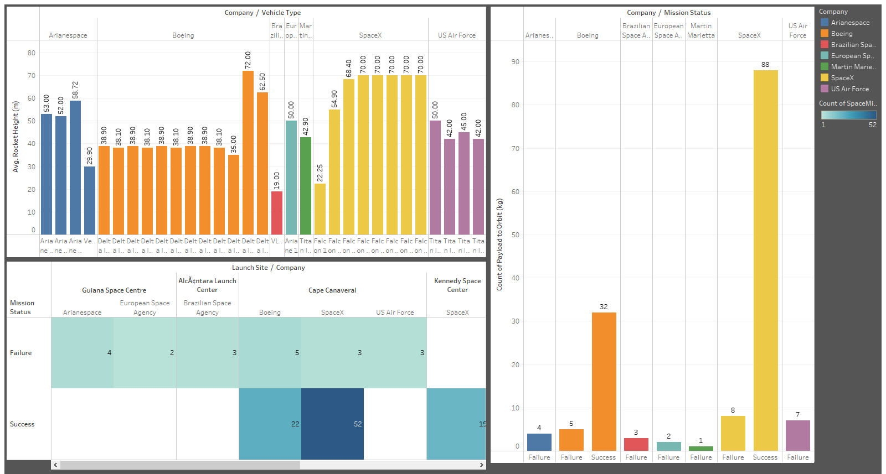

# SPACE MISSIONS

This data analysis project centres around exploring and visualizing key insights from a dataset related to space missions using the visualization tools of Tableau. The project involves collecting and cleaning data on various aspects of space missions, including launch dates, mission objectives, success rates, and participating companies among other factors. The aim is to develop an interactive dashboard(s) in Tableau, providing users with a dynamic platform to explore the data, apply filters and gain insights.

## Screenshots

*Average temperature at each launch site.*

*Windspeeds at each launch site.*

*Average humidity at each launch site.*

*Average height of all the rockets launched by each company.*

*Mission status of each rocket per company.*

*Track records of each company at different launch sites.*

*Dashboard 1.*

*Dashboard 2.*